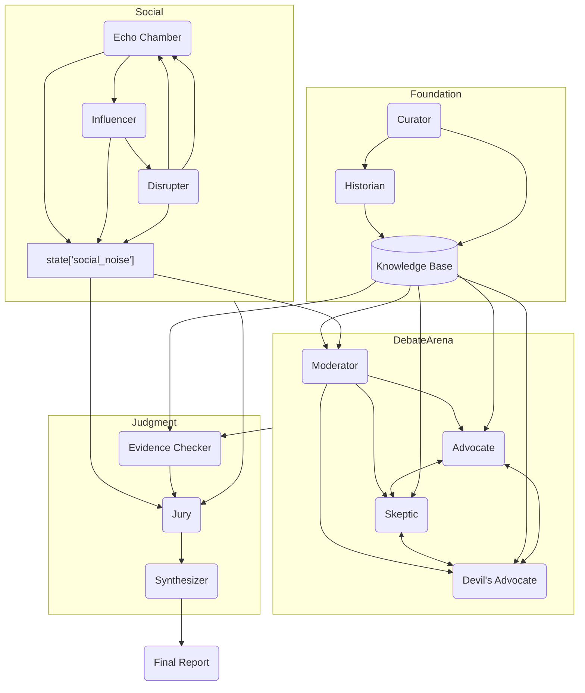

# ARCHITECTURE.md — 假新聞分析多代理辯論系統 V3（結合 Influencer & Social Noise → Moderator 機制）

> 目標：在 V2 基礎上，進一步強化 **社會動態層與辯論層的交互**，特別是讓 **Influencer 與 Social Noise 輸出可回饋至 Moderator**，作為議題調整與裁決參考，打造更貼近現實資訊戰的多代理模擬架構。

---

## 1. 設計原則（Design Principles）

- **Evidence-first**：所有論點必須附帶可驗證的證據鏈，並標明限制與信心。
- **Debate-as-Coordination**：回合制辯論，Moderator 需參考 **社會動態輸出**，以決定議題調度。
- **Social Feedback Loop**：Influencer 與 Disrupter 生成的 **Social Noise** 會回流至 Moderator，影響其議題聚焦與爭點標註。
- **Adjudication & Synthesis**：陪審團評分時納入社會風險，Synthesizer 彙整多源數據。
- **Pragmatic Orchestration**：落實於 Google ADK Agent Type 映射，確保可觀測與可重現。
- **Session-native State**：所有狀態管理必須依賴 `google.adk` 內建的 **session/state API**，禁止手動在程式碼中維護 state 變數，避免不可追蹤的隱性依賴。

---

## 2. 角色與職責（Agents & Roles）

### 2.1 資料基礎層（Foundation Layer）

- **Curator｜資料預處理**：輸入 → 結構化卡片（實體、情緒、來源、可信度）。
- **Historian｜歷史脈絡**：生成時間軸、模式比對，檢查舊聞新炒，更新至知識庫。

### 2.2 對話思辨層（Discourse Layer）

- **Moderator｜主持人**：控制辯論回合，聚焦子議題，參考 **Social Noise** 來判斷是否加入「社會反應視角」作為辯點。
- **Advocate｜正方**：基於證據支持主張。
- **Skeptic｜反方**：提出反證與挑戰。
- **Devil’s Advocate｜極端質疑者**：施壓式反對，找出潛在弱點。

### 2.3 社會動態層（Social Dynamics Layer）

- **Echo Chamber｜同溫層網路**：分群模擬，基於立場偏好與情緒擴散。
- **Influencer｜意見領袖**：放大或逆轉輿論，產生 **社會放大信號**。
- **Disrupter｜謠言製造者**：依輿論走向注入 **干擾性訊息**。
- **Social Noise｜社會噪音**：上述模擬產生的聚合數據，會傳遞給 Moderator 與 Jury，影響議題與評分。

### 2.4 裁決與整合層（Synthesis & Judgment Layer）

- **Evidence Checker｜證據查核者**：逐句查證，輸出證據鏈與信心。
- **Jury｜陪審團**：依「證據品質、邏輯嚴謹、韌性、社會影響」四維評分，並將 **Social Noise** 納入「社會影響分數」。
- **Synthesizer｜知識整合者**：產出終版報告，附結論、爭點、傳播風險與行動建議。

---

## 3. 系統總覽圖（Architecture Overview — V3）



---

## 4. 新增規範（Key Regulations in V3）

- **Moderator 的社會回饋規則**：Moderator 每一輪議題設定需參考 `session.state["social_noise"]`，若社會噪音顯示高極化/煽動，則優先安排該爭點進入下一輪辯論。
- **Social Noise 資料結構**：

```ts
interface SocialNoise {
  tick: number;
  polarization: number; // 0–1
  virality: number;     // R0 指數類比
  dominant_emotion: 'anger'|'fear'|'joy'|'neutral';
  influencer_boost: number;
  disruptive_injection?: string;
}
```

- **Jury 的社會影響評分**：若 `polarization > θ` 或 `virality > R0_threshold`，則社會風險分數下降，直接影響總體可信度。
- **State 管理規則**：必須統一透過 `ctx.session.state` 操作，禁止手動定義或修改全域 `state` 物件。

---

## 5. 與 Google ADK 對應（Mapping to ADK）

- **Foundation (Curator + Historian)** → `SequentialAgent`
- **Debate Arena (M, A, S, Dv)** → `LoopAgent` + `LlmAgent`
- **Social (EC, INF, DIS)** → `ParallelAgent` 產生多社群迭代，並輸出 Social Noise 至 `session.state`
- **Judgment (E, J, SY)** → `WorkflowAgent`（先查證，後評分，再整合報告）

---

## 6. Agent 專案結構（Best Practice）

建議每個 Agent 採用模組化專案目錄結構，而非單一 py 檔：

```
agent_name/
 ├── __init__.py   # 匯入與註冊入口
 ├── agent.py      # Agent 定義（LlmAgent/WorkflowAgent 等）
 ├── tools.py      # 工具函式（如搜尋、驗證、計算）
 └── schemas.py    # （可選）定義輸入/輸出 Pydantic 模型
```

此結構方便版本控管、測試與重用，符合 ADK 模組化設計原則。

---

## 7. 報告輸出（Synthesizer）

- **總體可信度**（含社會風險折減）
- **核心爭點地圖**（含社會視角）
- **傳播風險可視化**（極化曲線、Influencer 節點）
- **歷史脈絡**
- **建議行動**（媒體澄清、教育引導、應對策略）

